# VMware Tanzu Zero Trust: Integrating Istio mTLS and Avi AKO without the Sidecar Tax

**Author:** Alexander Lavrinovich

**GitHub:** [Alex-Electron](https://github.com/Alex-Electron)
**Email:** lavrinovich.alex@gmail.com

*Senior IT-consultant / Senior Trainer*

*Certified VMware Trainer | vExpert | VCAP | VCIX | VCP*

**Söldner Consult GmbH**
*Work E-Mail:* alexander.lavrinovich@soeldner-consult.de
*Website:* [www.soeldner-consult.de](https://www.soeldner-consult.de)

---

> I rebuild this vSphere-with-Tanzu and Istio lab often enough that the architecture choices are burned into my brain. A workload here can run three ways — bare Kubernetes, the classic Istio sidecar, or the new ambient mesh — and the decision that actually bites is how an external load balancer reaches pods that enforce mTLS. What follows is that pilot, deployed and measured end to end.

---

## TL;DR

A worked, reproducible pilot on VMware VKS (formerly vSphere with Tanzu): Istio's Bookinfo deployed three ways in one cluster — no mesh, classic sidecar, and ambient — fronted by the native Avi (NSX ALB) load balancer through the Kubernetes Gateway API, under mesh-wide `STRICT` mTLS. What's worth taking away, measured rather than asserted:

- **The landmine (Section 6).** Move the whole cluster to ambient the way every guide suggests, and external access stops working — silently. AKO still programs Avi, the VIP and pool come up healthy, yet every request dies at the VIP. Avi reaches your `STRICT` pods as an mTLS *client*, using a workload certificate AKO reads from `/etc/istio-output-certs` — a file **only the classic sidecar writes**. So exactly one namespace, `avi-system`, has to stay on the sidecar while everything else goes ambient.
- **Your load balancer is inside the mesh (Section 6).** Verified against the controller: every Avi pool fronting a `STRICT` namespace carries a client certificate and a PKI profile. The Service Engine is not sitting *in front of* the mesh — it is an authenticated client *within* it.
- **Ambient is cheaper, not free (Section 5).** Measured in-cluster: ambient adds ~+15 % p50 latency over no mesh; the classic sidecar ~+42 %. On memory the sidecar's tax is ~5× larger and grows with every pod, while ambient's is essentially fixed per node.
- **No new kernel feature — and not eBPF (Section 4).** Ambient is HBONE + ztunnel in userspace, riding decade-old kernel primitives (TPROXY, network namespaces).

Everything here is reproducible from the repository: pinned versions, the exact manifests, and the `step0`–`step4` scripts.

---

## 1. Why plaintext Kubernetes isn't enough — what mTLS is

In a default Kubernetes cluster, pods talk in plaintext. Compromise one frontend container, or get a shell on a worker node, and you can `tcpdump` the pod network and read database credentials, tokens, and business data straight off the wire. NetworkPolicies help, but they gate *who may connect, by IP and port* — they say nothing about *who the caller actually is*, and they encrypt nothing.

mTLS (mutual TLS) moves the trust decision from network location to cryptographic identity. Ordinary TLS authenticates only the server — your browser verifies the website, the website has no proof of who you are. Mutual TLS authenticates both ends before a single byte of application data is sent:

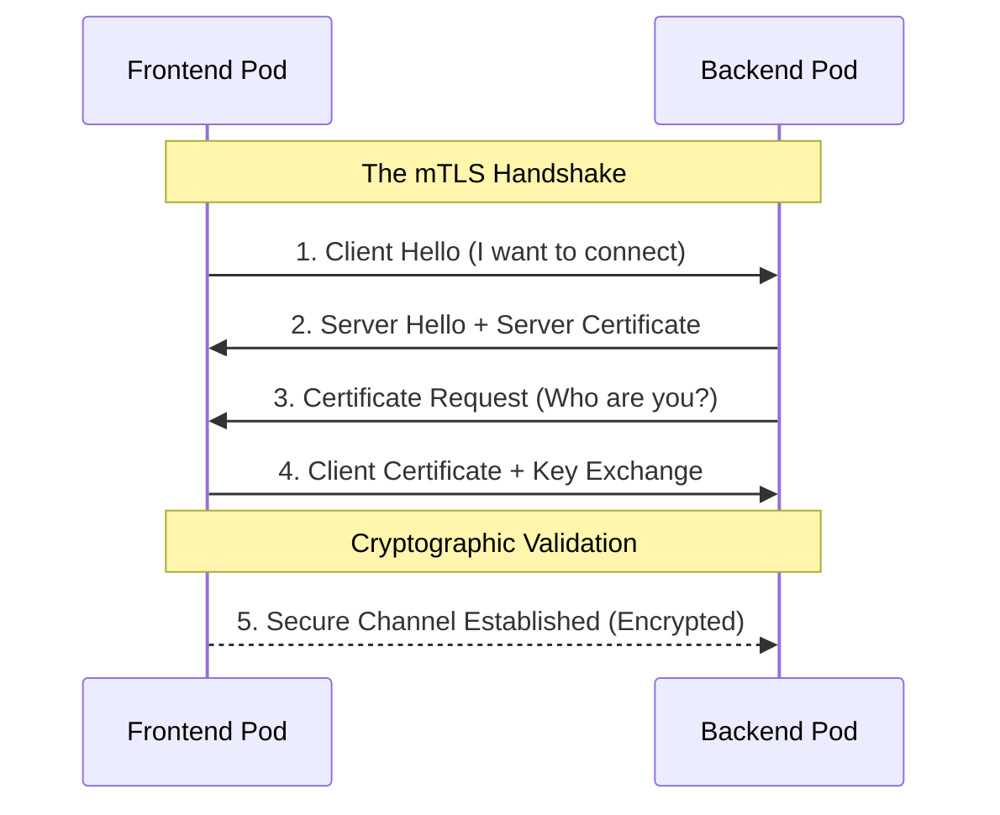

---

## 2. Istio — the tool that delivers it

<p align="center">
  <a href="https://istio.io/" target="_blank">
    
  </a>
</p>

Encryption is only one of the cross-cutting concerns every microservice shares; they also need to find each other, balance traffic, and retry failed calls. You *can* build all of that — security included — into the application itself (Netflix OSS, Spring Cloud and friends), but then every team re-implements the same networking logic in every language you happen to run, and keeps it in sync forever.

[**Istio**](https://istio.io/) is a **service mesh**: it lifts that networking, security, and observability logic out of the application and pushes it into the infrastructure, by intercepting the traffic between pods. The application code does not change; a proxy in the path does the work. Concretely, that buys three things:

- **Traffic management** — version routing and canaries, retries, timeouts, circuit breaking.
- **Security** — automatic mutual TLS between workloads and identity-based access policy. This is the focus of the article.
- **Observability** — per-request metrics and traces, because the mesh sees every call (it is what feeds the Kiali and Grafana views you'll see later).

In this pilot Istio is the **Zero-Trust enforcement layer** inside the VKS cluster, and the external entry point is VMware's NSX Advanced Load Balancer (Avi), wired in through the Gateway API (Section 6).

---

## 3. How Istio does mTLS

With Istio in place, mutual TLS is not something you build — it is something you switch on. Here is where each workload's identity comes from, how you enforce it, and proof that the network really drops anything that cannot present it.

### Where the identity comes from

The certificate is the whole point, so be precise about who issues it. Every Istio workload gets a SPIFFE identity derived from its Kubernetes service account — e.g. `spiffe://cluster.local/ns/bookinfo-istio-sidecar/sa/bookinfo-productpage`. In this pilot those workload certificates are issued and rotated by **istiod's built-in CA** — the default Istio setup, no external signer. (If you need mesh identities chained to a corporate PKI, that is what [`cert-manager-istio-csr`](https://github.com/cert-manager/istio-csr) is for — it makes istiod delegate signing to a cert-manager issuer — but this lab does not use it, and I keep it out of scope.)

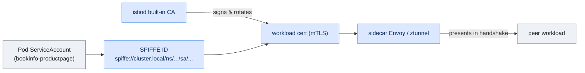

Do not conflate that with the *other* certificate in this story. The self-signed lab CA that cert-manager runs (`lab-ca-issuer`) signs the **external-facing TLS** on the Avi gateway's HTTPS listeners — the `bookinfo-tls` / `kiali-tls` / `grafana-tls` secrets, the cert your browser sees. Two CAs, two jobs: **istiod for in-mesh identity, the lab CA for the public edge.** Section 6 is where they meet.

Kiali makes the identity concrete: click any meshed edge and it shows `mTLS Enabled` together with the SPIFFE principals of both ends.

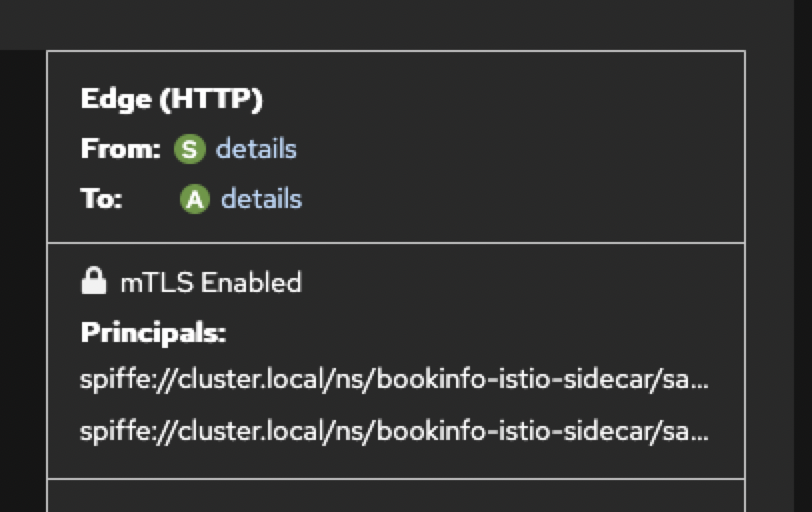

### The enforcement switch

Identity is useless until you require it. [`PeerAuthentication`](https://istio.io/latest/docs/reference/config/security/peer_authentication/) in `STRICT` mode tells the data plane to refuse any connection that is not mutually authenticated:

```yaml
apiVersion: security.istio.io/v1
kind: PeerAuthentication
metadata:
  name: default
  namespace: bookinfo-istio-sidecar
spec:
  mtls:
    mode: STRICT
```

Put this in `istio-system` and it applies mesh-wide. The pilot scopes it **per namespace** on purpose: the two meshed copies get `STRICT`, while `bookinfo-pure-k8s` is deliberately left outside the mesh as the plaintext control.

### Proof, not assertion

Asserting "the network drops it" is easy; here is the cluster doing it. From a pod in `default` that is **not** in the mesh, I call each copy's internal `productpage` service directly in plaintext — bypassing the gateway, i.e. the "attacker already has a foothold inside the cluster" case:

| From a non-mesh pod → internal service (`:9080`) | Result |
|---|---|
| `productpage.bookinfo-istio-sidecar` | TCP reaches the ClusterIP, then **connection reset** (`curl: (56)`, HTTP `000`) |
| `productpage.bookinfo-istio-ambient` | TCP reaches the ClusterIP, then **connection reset** (HTTP `000`) |
| `productpage.bookinfo-pure-k8s` | **HTTP 200** — plaintext, no mesh, readable by anyone on the pod network |
| in-mesh client → sidecar `productpage` | **HTTP 200** — a valid SPIFFE identity is accepted |

The connection *reaches* the service IP and is then torn down by the interceptor — the Envoy sidecar in one namespace, the node `ztunnel` in the other — because the caller presented no valid mesh certificate. The identical call from inside the mesh succeeds. What changed is the caller's identity, not a firewall rule and not the app's health. That is Zero Trust at the transport layer, and `./step4_verify_mtls.sh` reproduces exactly this check.

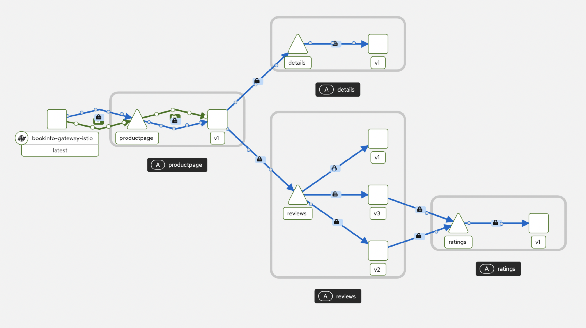

---

## 4. The three deployment paths — what they are, and how they differ

The whole comparison comes down to one question: **where does the mesh's proxy live?** Nowhere (plain Kubernetes), inside *every pod* (the classic sidecar), or once *per node* (ambient). I deployed the same Bookinfo app all three ways in one cluster (`tkc-01-mtls`) so the difference is concrete, not theoretical.

### Path A — Pure Kubernetes (no mesh)

No Istio at all. Pods talk directly over the CNI (Antrea, the VKS default); there is no proxy in the path.

- **Plus:** zero overhead; `tcpdump` shows the real traffic with no interception to reason about.
- **Minus:** no encryption; access control is only IP/port `NetworkPolicy`, which rots as the cluster grows; and no L7 telemetry, so there is nothing to see in Kiali.

### Path B — the classic sidecar

You label a namespace `istio-injection=enabled`, and Istio injects a second container — `istio-proxy` (Envoy) — into **every pod**. `istio-cni` programs the pod's networking so that *all* inbound and outbound traffic is transparently redirected through that local Envoy, which then does mTLS to the Envoy of whatever it talks to.

On Kubernetes 1.29+ (this lab is 1.34) that proxy is a **native sidecar**: it runs as an *init container with `restartPolicy: Always`*, so it starts before your app and stops after it. That detail confuses tooling — Kiali lists the proxy under "Istio Init Container" and shows "Istio Container: Not found," even though the pod is fully meshed and reads **2/2** in `kubectl get pods`.

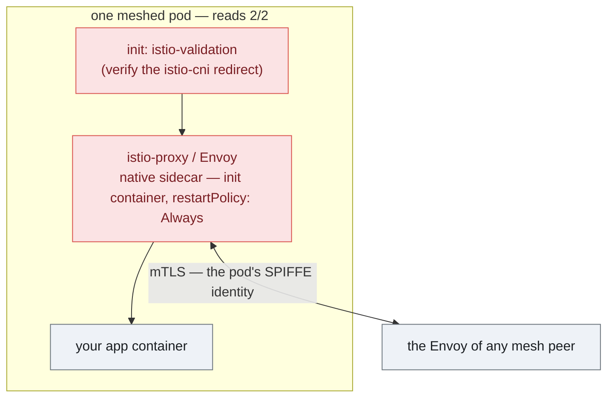

- **Plus:** the enforcement point sits at the pod's own front door — maximum control, and a pattern proven in production for years.
- **Minus:** an Envoy in *every* pod costs CPU and memory that scale with pod count (measured in Section 5); the app can race the proxy at startup; and upgrading Istio means a rolling restart of every meshed pod.

### Path C — ambient (sidecar-less)

Ambient removes the per-pod proxy entirely and splits the data plane in two:

1. **ztunnel** — a lightweight Rust DaemonSet, **one per node**. `istio-cni` redirects each pod's traffic to its node's ztunnel, which carries L4 **mTLS** over HBONE (mTLS inside an HTTP/2 `CONNECT` tunnel). One ztunnel serves every pod on the node.
2. **waypoint** — a standalone Envoy, **one per namespace** (the usual choice; it can also be scoped to a single service or service account), deployed *only where you need L7* (retries, header routing, L7 policy).

You onboard a namespace with the label `istio.io/dataplane-mode: ambient` — no injection; the app pods stay **1/1** and never know they are meshed.

```mermaid
flowchart LR
    subgraph nA["worker node A (source)"]
      pA["app pod (1/1)<br/>no proxy"] -->|"istio-cni redirect"| zA["ztunnel<br/>(per node, L4 mTLS)"]
    end
    subgraph nB["worker node B (destination)"]
      zB["ztunnel<br/>(per node)"] --> pB["app pod (1/1)"]
      wp["waypoint<br/>(destination namespace — L7 only)"]
    end
    zA -->|"HBONE — mTLS over HTTP/2 CONNECT"| zB
    zA -. "L7: via destination waypoint" .-> wp
    wp -. .-> zB
    class pA,pB app
    class zA,zB ambient
    class wp waypoint
    classDef app fill:#eef2f7,stroke:#6c757d,color:#1b1f23;
    classDef ambient fill:#dff3e4,stroke:#3a9d5d,color:#1e5631;
    classDef waypoint fill:#d7f0ef,stroke:#1899a0,color:#0b4f53;
```

- **Plus:** the data-plane cost is essentially fixed per node, not per pod (Section 5); no startup coupling; you can upgrade ztunnel/waypoint without touching business pods.
- **Minus:** more moving parts to reason about (pod → node ztunnel → peer node ztunnel → pod, plus a waypoint when L7 is needed) — and the catch this whole article turns on: an external load balancer can only reach a `STRICT`-mTLS ambient workload if *something* hands it a mesh certificate, which ambient alone does not (Section 6).

### Under the hood: ztunnel, HBONE — and why ambient is an improvement, not a downgrade

Two pieces make the sidecar-less model work, and both live in **userspace** — this is the part worth understanding before trusting it in production.

**ztunnel** (the "zero-trust tunnel") is a small Rust proxy, one per node, that does the L4 job a sidecar used to do per pod: it terminates and originates mutual TLS. The non-obvious detail is that it does *not* collapse every pod into one shared, anonymous identity. `istio-cni` hands ztunnel a file descriptor for each pod's network namespace; ztunnel opens its sockets *inside* that namespace and holds a **separate SPIFFE certificate for every workload identity** on the node. So the mTLS on the wire still carries the real `spiffe://…/ns/<ns>/sa/<sa>` of the calling pod — ambient is not a weaker Zero Trust, it is the *same* identity model with the proxy relocated from the pod to the node.

**HBONE** ("HTTP-Based Overlay Network") is how those connections travel between nodes. It is deliberately not a bespoke protocol: it is a standard **HTTP/2 `CONNECT` tunnel over mutual TLS, on port 15008**. The original destination rides in the `:authority` header, and a single HBONE tunnel multiplexes many independent connections. Using plain HTTP/2 CONNECT keeps the transport inspectable with ordinary tooling and reuses existing HTTP/2 machinery, while mTLS with mesh certificates supplies encryption *and* identity in the same handshake.

To clear up a common myth: **none of this needed a new Linux-kernel feature, and it is not eBPF.** The default data path is built from primitives that have been in mainline Linux for over a decade — network namespaces, netfilter/iptables with TPROXY and CONNMARK (TPROXY since 2.6.28, 2008), `SO_ORIGINAL_DST`, `splice()` — plus handing a netns file descriptor to ztunnel over a Unix socket (`SCM_RIGHTS`). eBPF appears only as an *opt-in* redirection backend; the Istio team weighed it for the core path and deliberately kept iptables so ambient works under any CNI. The cleverness is architectural, not kernel-level.

**Why this is a substantial improvement, concretely:**
- **Cost scales with nodes, not pods.** One ztunnel per node replaces an Envoy in every pod, so the data-plane footprint stops multiplying — see the memory and CPU results in Section 5.
- **No startup coupling.** The app no longer races a sidecar at boot; an entire class of init-ordering bugs disappears.
- **Upgrades stop being cluster-wide surgery.** You roll ztunnel/waypoint, not a restart of every meshed pod.
- **Applications are untouched** — no injection, no second container, nothing added to the pod spec. The app does not know it is in a mesh.
- **You pay for L7 only where you ask for it.** L4 mTLS comes free from ztunnel; a waypoint (a full Envoy) is added per namespace only when you need retries, header routing or L7 policy.

The honest counterweight runs through the rest of this article: the request path has more hops to reason about (Section 5), and an externally-fronted `STRICT`-mTLS ambient workload introduces the certificate problem that Section 6 is built around.

### The difference at a glance

| | pure-k8s | sidecar | ambient |
|---|---|---|---|
| where the proxy lives | — | in **every pod** (2nd container) | **per node** (ztunnel) + optional waypoint per ns |
| pod readiness | 1/1 | **2/2** | 1/1 |
| how traffic is intercepted | not intercepted | istio-cni → local Envoy | istio-cni → node ztunnel |
| L4 mTLS | ✗ | ✓ | ✓ (ztunnel) |
| L7 (retries, routing, filters) | ✗ | ✓ everywhere | only through a waypoint |
| data-plane cost scales with | — | **pods** | **nodes** (+ waypoints) |
| startup coupling | none | app waits on the proxy | none |
| Istio upgrade | — | rolling-restart every pod | update ztunnel/waypoint; apps untouched |

---

## 5. What the three modes cost

Running the same app three ways at once exists for one reason: to make the cost of the mesh *measurable* instead of asserted. To keep the comparison clean I measure **from inside the cluster**: a `fortio` pod is deployed into each mode's own namespace — so it inherits that mode (sidecar gets injected, ambient is captured by ztunnel, plain stays plain) — and drives the local `productpage` directly. That removes the workstation and the VPN tunnel as variables, and it measures the full in-mesh hop: the client's proxying as well as the server's. The three modes run **one at a time**, interleaved over three rounds, so they never contend for the same nodes at once; the load is a fixed 50 rps that the cluster serves at 100% success, with the background generator off.

One honest note up front: this is a nested vSphere lab, so treat the absolute milliseconds as orders of magnitude. The *relative* cost between the three modes is the part that holds.

### What you are actually paying for is the request path

A single `productpage` view is not one hop — it fans out to `details` and `reviews`, and `reviews` calls `ratings`. Every one of those in-cluster hops is where a mesh inserts itself, so the architecture of that insertion is the whole story:

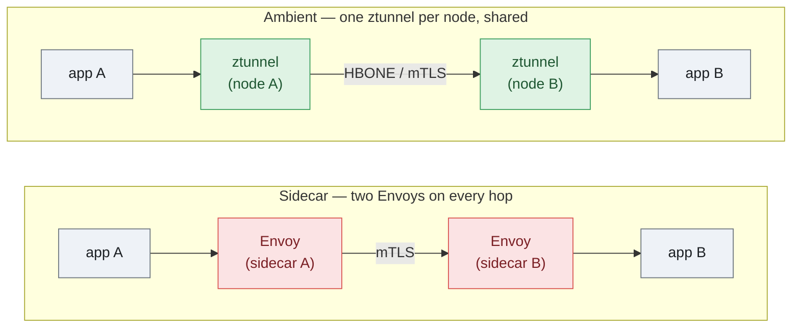

In **sidecar** mode each hop crosses two Envoy proxies — the caller's and the callee's — and each terminates TLS, checks policy, and emits telemetry. That is the literal price of putting the enforcement point at every pod's front door. In **ambient** mode the pod's traffic is captured by the node-local `ztunnel` (one per node), tunneled to the destination node's `ztunnel` over HBONE (HTTP/2 `CONNECT`), and handed to the pod — one shared L4 mTLS hop per direction, no Envoy inside the pod. L7 features (retries, header routing) only enter the path if you attach a waypoint to a namespace.

### Latency

**How to read p50 / p90 / p99:** line every request up by how long it took. `p50` is the **median** — the *typical* request, with half faster and half slower. `p90` is the value 9 out of 10 requests beat — the "slow but not rare" experience. `p99` is the **tail** — only the worst 1% are slower than this. Percentiles are used instead of a plain average because a few slow outliers quietly drag an average around; for all of them, lower is better.

`fortio`, 50 rps per mode, 120 s, median of three runs, every mode at 100% success:

| Mode | p50 (ms) | p90 (ms) | p99 (ms) | mean (ms) | added vs pure-k8s (p50 / mean) |
|---|---|---|---|---|---|
| pure-k8s | 66.9 | 93.1 | 153.9 | 68.6 | — |
| **ambient** | 77.0 | 110.8 | 158.5 | 76.6 | **+10 ms (+15%) / +8 ms (+12%)** |
| **sidecar** | 95.1 | 131.8 | 173.6 | 96.9 | **+28 ms (+42%) / +28 ms (+41%)** |

Neither mesh is free — and measuring from inside is what makes that visible. The client is itself in the mesh, and a `/productpage` view fans out to `details`, `reviews` and `ratings`; in **sidecar** mode every one of those hops crosses two Envoys, so the cost compounds across the call graph: about **+28 ms (+42%)**. In **ambient** the same hops ride the lightweight node `ztunnel` (plus one waypoint for L7), so the tax is roughly a third of that: about **+10 ms (+15%)**. The ordering held across all three runs. (An earlier external test over the VPN tunnel made ambient look almost free — that was the tunnel's RTT swamping the deltas while the client sat outside the mesh. The in-cluster numbers above are the honest ones.)

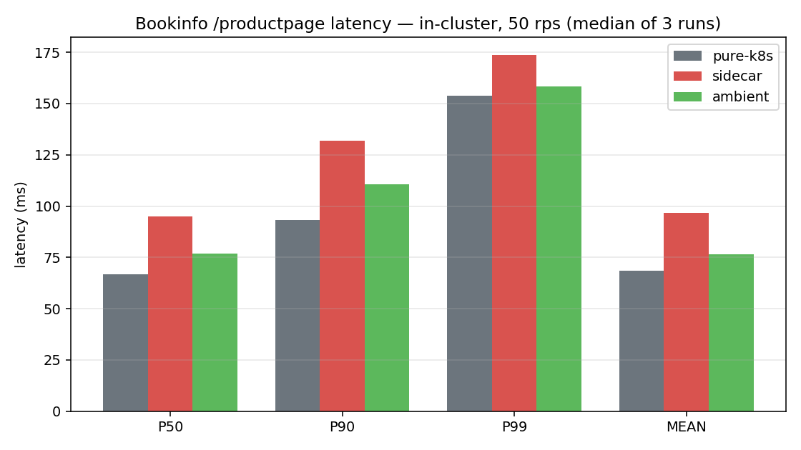

### Resource footprint

This is where the gap is structural, not marginal. Per-component cost under the same load:

| Component | where it runs | CPU | memory |
|---|---|---|---|
| sidecar `istio-proxy` | **in every meshed pod** | ~27m | ~42Mi |
| ambient `ztunnel` | one **per node** | ~3m | ~4Mi |
| ambient `waypoint` (only for L7) | one **per namespace** | ~7m | ~69Mi |

Sidecar cost scales with the number of **pods**; ambient cost is essentially **fixed** — a per-node ztunnel plus, if you want L7, a single waypoint per namespace. Totalled over the whole namespace, Grafana shows the consequence directly:

| Approach | total namespace memory | mesh overhead |
|---|---|---|
| pure-k8s | ~800 MiB | — |
| ambient | ~857 MiB | **+~58 MiB** |
| sidecar | ~1.08 GiB | **+~300 MiB** |

At this six-pod scale the mesh memory tax is **~5× smaller for ambient**, and because sidecar adds ~42Mi to *every* pod while ambient's cost barely moves, the gap only widens with pod count — the two are roughly even only down around one or two pods, where ambient's fixed waypoint dominates. Note the inversion that surprises people: a single waypoint (~69Mi) is actually *heavier* than a single sidecar (~42Mi); it simply doesn't multiply. And where you don't need L7 you drop the waypoint entirely, leaving ambient's data plane at the few-MiB per-node ztunnel.

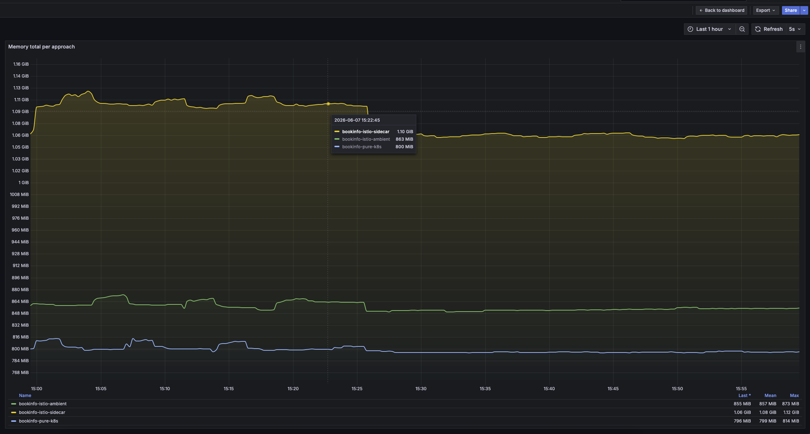
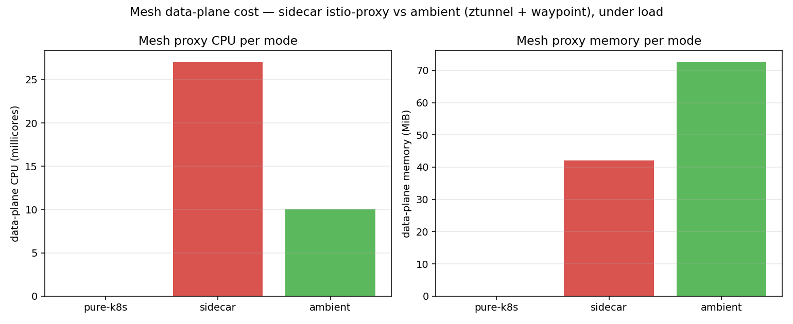

### Methodology — and how it lines up with published numbers

Every figure above comes from `fortio` driven **from inside the cluster**, one mode at a time. The protocol: a `fortio` pod in each mode's own namespace; 16 connections at a fixed **50 rps** with `STRICT` mTLS on; **120 s** per run after a discarded **20 s** warm-up; **three rounds interleaved** (`pure → sidecar → ambient`, repeated) so slow drift in the lab cancels; the background generator off throughout. Latency is fortio's own histogram (median of the three rounds); resources are `kubectl top` per container over each run, cross-checked against Grafana's "memory total per approach" panel.

Two honest limits on reading these numbers:
- **p99 is not a ranking metric here** — its order flipped between runs (the bare app sometimes showed a *worse* tail than the meshed modes, because a proxy smooths bursts through connection pooling). Rank on p50 and mean.
- **`/productpage` is a multi-hop page view**, not a single proxy hop: it fans out to three services, and in sidecar mode every hop crosses two Envoys, so the cost compounds. That compounding is also why percentages mislead at the extremes. I re-ran the test against a trivial leaf service (`details`, ~8 ms baseline) to isolate one in-mesh hop: in absolute terms it adds about **+10 ms for sidecar and +2 ms for ambient** — figures that read as a *huge* percentage on an endpoint that does almost no work, then shrink to the moderate share in the table once the request does real work. So the multi-hop page view is the honest headline; the per-hop run only confirms the ratio — a sidecar hop costs roughly **5×** an ambient one.

For calibration, the *shape* matches the public baselines. Istio's own [performance page](https://istio.io/latest/docs/ops/deployment/performance-and-scalability/) (Fortio, 1 KB payload, fixed connections, mTLS) reports per proxy at 1000 rps roughly **sidecar 0.20 vCPU / 60 MB, waypoint 0.25 vCPU / 60 MB, ztunnel 0.06 vCPU / 12 MB** — the same ordering we measured (ztunnel cheapest; waypoint heavy but single; sidecar multiplied per pod). [CNCF's independent testing](https://www.cncf.io/blog/2024/08/23/ambient-mesh-can-sidecar-less-istio-make-your-application-faster/) puts ambient near **+15 %** over baseline — exactly our ambient p50 tax. Our absolute milliseconds are smaller (50 rps on a nested lab, not 1000 rps on bare metal), but the direction and the ~5× memory ratio agree.

### What this does not claim

These are lab numbers from a nested cluster — a demonstration that the three modes are deployable side by side and that their costs differ in the direction and rough magnitude shown, not an SLA. The whole measurement is reproducible: the in-cluster `fortio` bench, the load generator, and the `mesh-compare` Grafana dashboard all ship in the repo (`pilot-2-self-signed/`), so you can run the same comparison on your own hardware.

---

## 6. The core: external access through Gateway API and Avi AKO

This is the part that is specific to VMware Tanzu, and the reason the pilot exists. A Zero-Trust mesh that nothing outside can reach is useless; the real question is how an external load balancer reaches pods that enforce `STRICT` mTLS — when the load balancer is not itself a member of the mesh.

### Why Avi/AKO, and not the other VKS load balancers

VKS can front workloads with NSX, the legacy HAProxy, or the NSX Advanced Load Balancer (Avi). For this job only Avi qualifies, because it ships the **Avi Kubernetes Operator (AKO)** — a controller that implements the Kubernetes **Gateway API** natively *and* can speak **mTLS into the mesh**. NSX-LB and HAProxy can only park a dumb L4 VIP in front of an Istio ingress gateway; they have no notion that the backend wants a client certificate. AKO does, and that is what makes native L7 ingress into a STRICT-mTLS cluster possible at all.

### How the path actually works (verified on the lab)

Each scenario is exposed with a Gateway API `Gateway` of class `istio`, which Istio realizes as an ingress-gateway Deployment (`bookinfo-gateway-istio`) behind a `LoadBalancer` Service. AKO watches that Service and programs Avi: it allocates a VIP from the configured VIP network (`net-10.144.6`), publishes the hostname in the Avi DNS, and builds a pool whose members are the **gateway pods**.

The non-obvious part is that pool. I inspected the Avi configuration directly, and every workload pool is built with a **client certificate, a PKI profile, and an SSL profile** — that is, the Avi Service Engine connects to the gateway pod over **mTLS**, presenting a mesh workload certificate and validating the pod's. It has to: the gateway pods live in the `STRICT` namespaces, so a plaintext Service-Engine connection would be reset exactly like the rogue pod in Section 3.

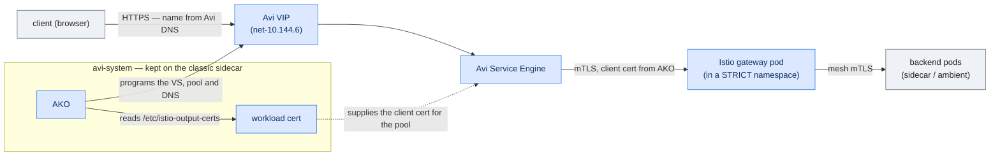

### Where the certificate comes from — and why `avi-system` is the exception

`AKOSettings.istioEnabled: true` is what tells AKO to put that client certificate on every pool. But AKO can only present a mesh certificate if it *has* one, and Istio hands a workload a certificate by writing it into `/etc/istio-output-certs` — which **only the classic sidecar does**. Ambient's ztunnel never writes a certificate inside the pod.

So the cluster runs a deliberate hybrid, and this is the single most important decision in the whole setup:

- business namespaces → **ambient** (cheap, no per-pod proxy — see Section 5);
- the `avi-system` namespace, where AKO runs → **classic sidecar** (`istio-injection=enabled`), precisely so that `/etc/istio-output-certs` exists for AKO to read.

Remove that one exception and the ingress fails silently: AKO still comes up and still programs Avi, but the Service Engine has no certificate to present, the STRICT gateway pods reject it, and every external request dies at the VIP. **An all-ambient cluster cannot serve Avi-fronted mTLS ingress** — and nothing in the logs points at the missing sidecar.

The pinned AKO values that wire this up (full file: [`manifests/03-ako-values.yaml`](pilot-2-self-signed/manifests/03-ako-values.yaml)):

```yaml
AKOSettings:
  clusterName: 'tkc-01-mtls'
  istioEnabled: true        # put the mesh client cert on every Avi pool
  enableEVH: true
  cniPlugin: 'antrea'
featureGates:
  GatewayAPI: true          # AKO implements the Kubernetes Gateway API
NetworkSettings:
  vipNetworkList:
    - networkName: net-10.144.6
      cidr: 10.144.6.0/24
```

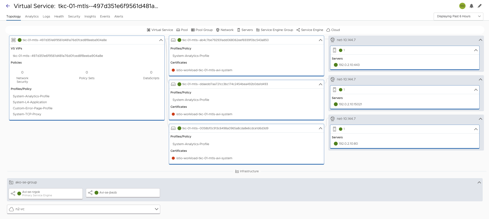

---

## 7. When to use what

A decision guide, not a verdict — in practice the right answer is a mix:

- **Plain Kubernetes** is fine for a sandbox or a throwaway namespace. The moment you have compliance, multi-tenancy, or anything you would not want to see in a `tcpdump`, IP/port `NetworkPolicy` is not enough: no encryption, no workload identity.
- **Ambient is my default for business workloads** — Istio itself doesn't call either mode the default (its docs frame it as a choice, "Sidecar or ambient?", and note sidecar is currently the only mode that supports multi-cluster and VM workloads). For single-cluster, no-VM workloads I reach for ambient: transparent L4 mTLS via ztunnel, no per-pod proxy, cost that scales with nodes instead of pods, no rolling restart on upgrade. Add a **waypoint** only in the namespaces that genuinely need L7 (retries, header routing, L7 authz), remembering it is a fixed per-namespace cost, not per-pod (Section 5).
- **The classic sidecar stays useful, but targeted.** Keep it where a workload truly needs its own L7 proxy at the pod edge — and, in this stack specifically, for the **`avi-system`** namespace, because AKO's mTLS-into-mesh depends on the sidecar writing `/etc/istio-output-certs` (Section 6). That is the load-bearing exception, not a default.
- **Get to `STRICT` early — but mind greenfield vs brownfield.** For a greenfield or fully-meshed namespace (including ambient, where ztunnel covers every enrolled workload) apply a `STRICT` `PeerAuthentication` from the start — there are no plaintext legacy clients to break. Note that even ambient ships `PERMISSIVE` by default, so `STRICT` is always an explicit opt-in. When you are onboarding *existing* workloads, Istio recommends `PERMISSIVE` as a temporary bridge while you migrate clients, then locking the namespace down to `STRICT` (confirm no plaintext remains first — the Grafana mTLS view makes that visible). In my experience `PERMISSIVE` outlives its purpose and plaintext lingers, so treat it as a short bridge to end deliberately, not a multi-year default.

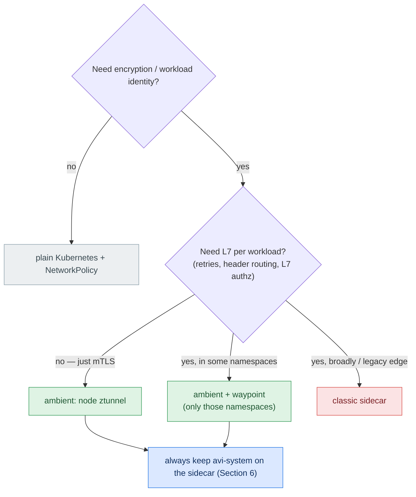

---

## 8. Reproduce it yourself

The whole pilot runs from this repository — pinned versions, the exact manifests, and a five-step script flow.

**Built and measured on:** VKS (formerly vSphere with Tanzu) 3.6.2 / Kubernetes 1.34 · Istio 1.30.0 (ambient profile) · AKO 2.1.4 · NSX ALB (Avi) 31.2.2 · Kubernetes Gateway API · cert-manager (self-signed lab CA). Nodes: Photon OS, kernel 6.1.

**The flow** (run in order from `pilot-2-self-signed/`):

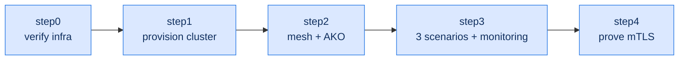

- **`step0`** — pre-flight: workstation tools, Avi Service Engines / DNS, and a server-side dry-run of the cluster manifest
- **`step1`** — provision the workload cluster (`tkc-01-mtls`)
- **`step2`** — install Istio (ambient), cert-manager + a self-signed lab CA, and AKO in Istio mode (with `avi-system` pinned to the sidecar)
- **`step3`** — deploy Bookinfo three ways plus Kiali / Prometheus / Grafana, each behind an Avi VIP via the Gateway API
- **`step4`** — prove `STRICT` mTLS drops non-mesh plaintext while the in-mesh path still answers

**Full guide:** [**`pilot-2-self-signed/README.md`**](pilot-2-self-signed/README.md) — the prerequisites (vSphere, NSX ALB / Avi, the Supervisor fronted by Avi, and the Avi DNS service for the Gateway API hostnames), what each step produces, and why. The in-cluster `fortio` bench (`pilot-2-self-signed/bench/`) and the provisioned `mesh-compare` Grafana dashboard reproduce the Section 5 numbers.
